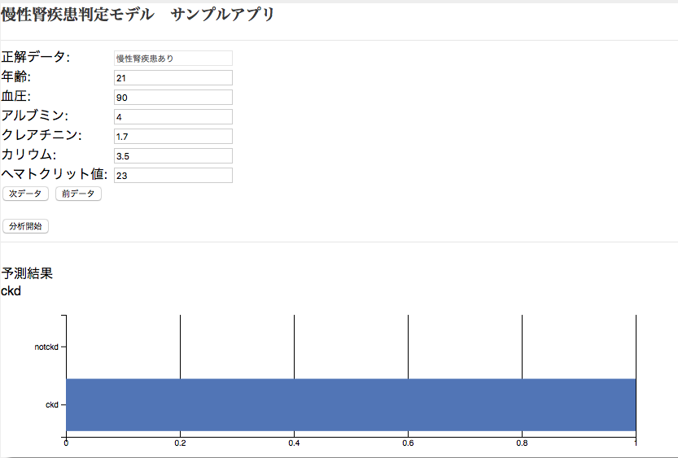

# 慢性腎疾患判定モデル サンプルアプリ

## アプリケーションの説明
このアプリケーションは**Watson Studio**の**SPSS Modeler**で作った慢性腎疾患モデルにWebサービス経由でアクセスし、該当データの持ち主が慢性腎疾患にかかっているかどうかを判定します。

  

## 前提
Watson Studio上で、慢性腎疾患判定モデルの構築、学習、保存、WEBサービス化、テストまでできていることが前提です。  
詳細手順に関しては、[SPSSクラウド版で簡単機械学習](https://qiita.com/makaishi2/items/85d7694168e71ee3c094)を参照して下さい。

## 前提ソフトの導入
次の前提ソフトが導入されていることが前提です。

[gitコマンドラインツール][git] (なくても可)   
[Cloud Foundryコマンドラインツール][cloud_foundry]  
  
注意: Cloud Foundaryのバージョンは最新として下さい。 

## ソースのダウンロード
Githubからアプリケーションのソースをダウンロードします。  
カレントディレクトリのサブディレクトリにソースはダウンロードされるので、あらかじめ適当なサブディレクトリを作り、そこにcdしてから下記のコマンドを実行します。  
GITコマンドを使わない場合は、[Github](https://github.com/makaishi2/wml-kidney-spss-sample)にブラウザからアクセスして、zipファイルをダウンロード後、解凍します。  
ダウンロード後、できたサブディレクトリにcdします。
 

```sh
$ cd (適当なサブディレクトリ)
$ git clone https://github.com/makaishi2/kidney-spss-sample.git
$ cd kidney-spss-sample
```

## CFコマンドでログイン
CFコマンドでIBM Cloud環境にログインします。  
ログイン名、パスワードはIBM Cloudアカウント登録で登録したものを利用します。  
ログインに成功すると、次のような画面となります。  

```
$ cf api https://api.ng.bluemix.net
$ cf login
```

  

## Watson ML サービス名の確認
次のコマンドでWatson MLのサービス名を確認します。  

``
$ cf s
``

**サービス**が**pm-20**となっている項目の**名称**の部分がサービス名になります。  
以下の手順ではこの名称を**\<ml_name\>**とします。  
名称にブランクが含まれている場合、ダブルクオートで囲む必要がある点に注意して下さい。  
(例) "Machine Learning-ab"

## アプリケーションのデプロイ

次のコマンドを実行します。
**\<service_name\>** はなんでもいいのですが、インターネット上のURLの一部となるので、ユニークな名前を指定します。  
(例) **wml-kidney-spss-aka7**

```
$ cf push <service_name>
```

## サービスのバインド、環境変数の設定

以下のコマンドで、Watson MLのサービスとのバインド及び、WebサービスエンドポイントURLの設定を行います。
エンドポイントURLの取得方法については、[SPSSクラウド版で簡単機械学習](https://qiita.com/makaishi2/items/85d7694168e71ee3c094)を参考にして下さい。  
最後のコマンドの実行には数分かかります。  

```
$ cf bs <service_name> <ml_name>
$ cf se <service_name> SCORING_URL <scoring_url>
$ cf rg <service_name>
```

## アプリケーションのURLと起動
次のコマンドでデプロイしたサービスのURLを確認して下さい。

```
$ cf a
```

上記のコマンドで調べたURLをブラウザから入力すると、アプリケーション画面が起動されます。  

## アプリケーションを修正する場合

導入手順中、git cloneコマンドでダウンロードしたローカルリポジトリにアプリケーションのソースコードが入っています。  
アプリケーションを修正したい場合は、ローカルのソースを修正し、再度 ``cf push <service_name>`` コマンドを実行すると、IBM Cloud上のアプリケーションが更新されます。  

## ローカルで起動する場合

アプリケーションを修正する時は、ローカルでもテストできる方が便利です。そのための手順は以下の通りです。

* Pythonの導入  
ローカルにPython(v3)を導入する必要があります。　MACの場合は最初から導入済みなのでこの手順は不要です。
* 認証情報の確認  
BluemixダッシュボードからWMLサービスの管理画面を開き、接続用の認証情報を調べてテキストエディタなどにコピーします。
* .envファイルの設定  
次のコマンドで.env.exampleファイルの雛形から.envをコピーし、エディタで調べたu認証情報とSCORING_URLを設定します。

```sh
$ cp .env.example .env
```

```sh
WML_URL="https://ibm-watson-ml.mybluemix.net"
WML_USERNAME="xxxx"
WML_PASSWORD="xxxx"
WML_INSTANCE_ID="xxxx"
SCORING_URL="xxxx"
```

* Pythonアプリケーションの導入、実行  
以下のコマンドでアプリケーションの導入、実行を行います。

```sh
$ python server.py
```

[cloud_foundry]: https://github.com/cloudfoundry/cli#downloads
[git]: https://git-scm.com/downloads
[sign_up]: https://bluemix.net/registration
 
